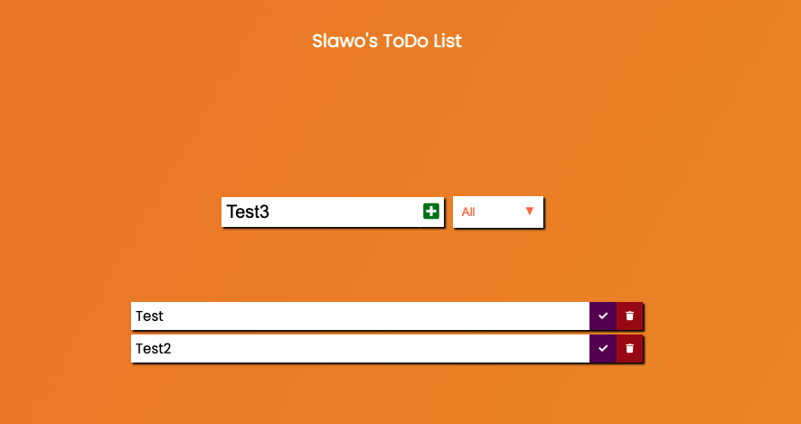
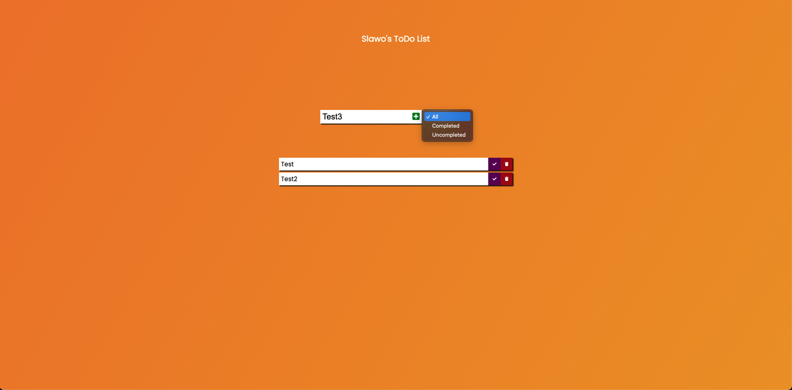
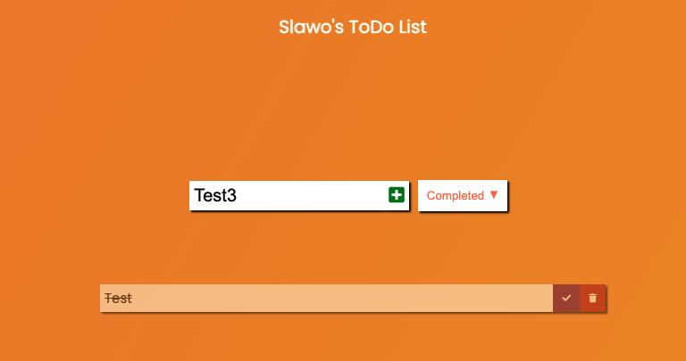

# JavaScript ToDo list

Simple vanilla.js ToDo list using dthe localStorage for completed & uncompleted tasks

You can see the result here: [**Click me**](https://slawoe.github.io/js_todo/)

### Example Screenshots

